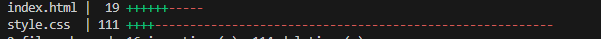

# Lab 4 - CSS Libraries/Frameworks

by Revenco Victor - FAF-221

## Project Overview
This laboratory is about using a CSS framework to simplify and streamline the process of designing the landing page.

## Features
- **Hero page designed using tailwindcss**
- **About us page designed using tailwindcss**

For both pages, we removed what was made of styling from styling.css and used tailwindcss to design them similar to the previous version.

## POC
Using Tailwindcss I was able to write less code, both in lines and in letter count, which showcases why this framework makes styling more efficient. Also being responsive out of the box helps a lot as I only have to use prefixes such as sm and md to make a responsive landing page.

These screenshots show that using Tailwindcss I was able to drasticaly reduce the number of lines in my project which helps a lot with readability and overall efficiency.

## Technologies Used
- **HTML5** for page structure
- **CSS3** for styling
- **Git & GitHub** for version control
- **GitHub pages** for hosting
- **Tailwindcss** for building user interface

## Screenshots

## Live Demo
[View the deployed project here](https://kipitokisk.github.io/WEB_Lab/)

[View the live project in video format here](https://drive.google.com/file/d/1mx6u4-VgTDkohJlP2jz2jNFl-XRTVMwE/view?usp=sharing)